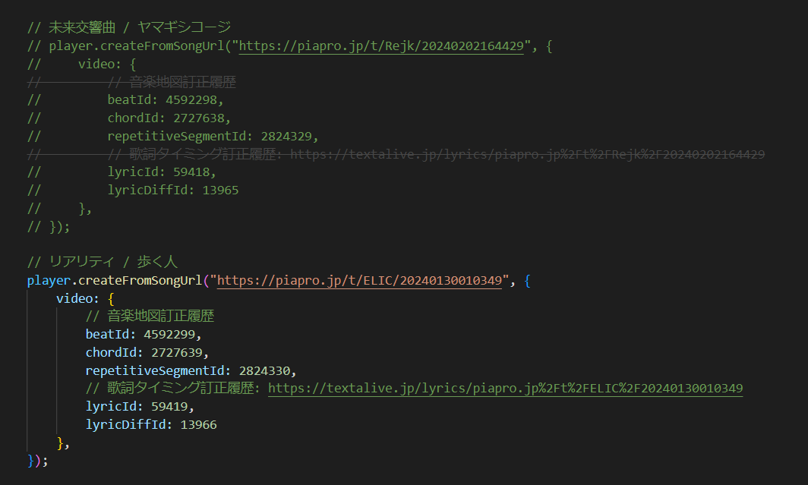

# Hatsune Miku Magical Mirai 2024 - Sekai Basket
Welcome to my participation for the [2024 Hatsune Miku Magical Mirai contest](https://magicalmirai.com/2024/procon/index_en.html) !

In here you will find a simplistic web game built with the [TextAlive API](https://developer.textalive.jp/) !

I hope you will have some fun with the application !

## The game
The game is very simple !

It is similar to the games where you have to collect fruits falling from the sky into a basket, but here you will collect words from the songs that are being played !

To do so, just move your mouse from left to right and try to catch them before they reach the bottom of the page :)

Catching them in a row will increase a mulitplier, but missing one will drop it right back down to 0 !


Example : 

(GIF fps way slower than the app ofc)

## Run the application
After cloning the repository you can run the following commands to get the application running.
```sh
npm install
npm run dev
```
## Change songs
If you wish to change the song that is being played you can change it in the code by simply commenting/uncommenting the chosen code : 

(song with beatId 4592299 currently chosen in the screenshot)
Tip : in Visual Studio code you can uncomment a block of code using *CTRL + K + U* and mass commenting with *CTRL + K + C*

## Build
If you wish to do so you can build the application with vite using this command (warning: it wasn't tested much due to lack of time... if possible to use npm run dev, please prefer it as I know it works)
```sh
npm run build
```

## Potential improvements
As with all my projects I like to think about what could be improved.
With this web app there is so much that could be done but here is a small list of improvements I think would make it even better. 
- Choosing song directly in app with a menu
- Keeping the highest score in session or stored on the server
- making it multiplayer by introducing sessions and leaderboards
- keep the full random mode (letter falling randomly)
- introduce a more controlled mode, where all runs would be the same (more fair for multiplayer)

## Closing thoughts
I wish I could have spent more time on it but I really enjoyed discovering the api and learning more JS !

I do hope you will have fun with it !